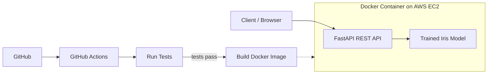

# Containerized ML Prediction API using FastAPI, Docker and AWS EC2

A REST API that predicts the species of an Iris flower (setosa, versicolor, virginica) from four measurements. The model is trained with Scikit-learn, served with FastAPI, packaged in Docker, tested with pytest, checked by GitHub Actions and deployed live on AWS EC2.

## Live Demo

- **Swagger UI (try the API):** http://15.206.148.166:8000/docs
- **Health check:** http://15.206.148.166:8000/health

## Architecture



## Tech Stack

Python, Scikit-learn (RandomForest), FastAPI, Uvicorn, pytest, Docker, GitHub Actions, AWS EC2

## Folder Structure

```
iris-ml-api/
├── app/
│   ├── main.py            # FastAPI endpoints
│   └── model_utils.py     # loads model and predicts
├── model/                 # trained model is saved here
├── tests/                 # pytest test cases
├── .github/workflows/ci.yml
├── Dockerfile
├── requirements.txt
└── train_model.py         # trains and saves the model
```

## API Endpoints

| Method | Endpoint   | Description                     |
|--------|------------|---------------------------------|
| GET    | `/health`  | Checks that the API is running  |
| POST   | `/predict` | Returns the predicted species   |
| GET    | `/docs`    | Swagger UI documentation        |

**Example request** (`POST http://15.206.148.166:8000/predict`)

```json
{
  "sepal_length": 5.1,
  "sepal_width": 3.5,
  "petal_length": 1.4,
  "petal_width": 0.2
}
```

**Example response**

```json
{ "predicted_species": "setosa" }
```

Invalid input (missing field, text instead of number, negative value) returns HTTP 422.

## How the Model Works

`train_model.py` loads the Iris dataset, splits it into training and test data, trains a RandomForest classifier (about 90% test accuracy) and saves it with joblib. The Docker build runs this script, so the trained model is always inside the container.

## Testing

7 automated pytest tests cover the health endpoint, valid predictions, correct species output and rejection of invalid inputs. They run automatically in GitHub Actions on every push.

## CI/CD (GitHub Actions)

On every push to `main`, the workflow in `.github/workflows/ci.yml` runs two jobs:

1. **Run tests:** installs dependencies, trains the model and runs pytest.
2. **Build Docker image:** uses `needs: test`, so it runs only if all tests pass. If any test fails, the pipeline stops and the image is never built.

## Deployment on AWS EC2

The app runs as a Docker container on an Ubuntu EC2 instance (region ap-south-1). The instance's security group allows port **8000** so the API is reachable from a browser. The server installs Docker, clones this repository, builds the image and starts the container using these commands:

```
sudo apt update
sudo apt install -y docker.io git
sudo systemctl enable --now docker
git clone https://github.com/Garimaahuja04/iris-ml-api.git
cd iris-ml-api
sudo docker build -t iris-ml-api .
sudo docker run -d -p 8000:8000 --restart unless-stopped --name iris-api iris-ml-api
```

## Future Scope

- Automatic deployment to EC2 from GitHub Actions using GitHub Secrets
- Push the image to a registry (Docker Hub or AWS ECR)
- Add a simple web form, logging and monitoring
