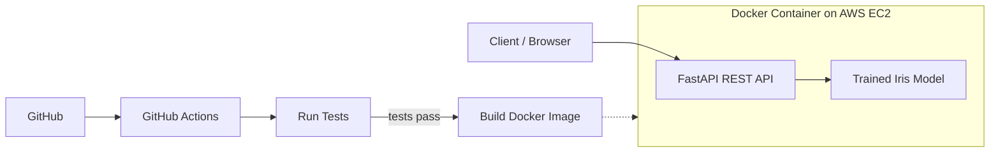

# Containerized ML Prediction API using FastAPI, Docker and AWS EC2

A small REST API that predicts the species of an Iris flower (setosa, versicolor, virginica) from four measurements. The model is trained with Scikit-learn, served with FastAPI, packaged in Docker, tested with pytest, checked by GitHub Actions and deployed on AWS EC2.

## Architecture



## Tech Stack

Python, Scikit-learn (RandomForest), FastAPI, Uvicorn, pytest, Docker, GitHub Actions, AWS EC2

## Folder Structure

```
iris-ml-api/
├── app/
│   ├── main.py            # FastAPI endpoints
│   └── model_utils.py     # loads model and predicts
├── model/                 # trained model is saved here
├── tests/                 # pytest test cases
├── .github/workflows/ci.yml
├── Dockerfile
├── requirements.txt
└── train_model.py         # trains and saves the model
```

## API Endpoints

| Method | Endpoint   | Description                     |
|--------|------------|---------------------------------|
| GET    | `/health`  | Checks that the API is running  |
| POST   | `/predict` | Returns the predicted species   |
| GET    | `/docs`    | Swagger UI documentation        |

**Example request**

```json
{
  "sepal_length": 5.1,
  "sepal_width": 3.5,
  "petal_length": 1.4,
  "petal_width": 0.2
}
```

**Example response**

```json
{ "predicted_species": "setosa" }
```

Invalid input (missing field, text instead of number, negative value) returns HTTP 422.

## Run Locally

```
pip install -r requirements.txt
python train_model.py
python -m uvicorn app.main:app --reload
```

Open http://127.0.0.1:8000/docs

## Run Tests

```
python -m pytest -v
```

7 tests cover the health endpoint, valid predictions, correct species and invalid inputs.

## Run with Docker

```
docker build -t iris-ml-api .
docker run -d -p 8000:8000 --name iris-api iris-ml-api
```

Open http://localhost:8000/docs

## CI/CD (GitHub Actions)

On every push to `main` the workflow in `.github/workflows/ci.yml` does:

1. **Run tests:** installs dependencies, trains the model and runs pytest.
2. **Build Docker image:** this job uses `needs: test`, so it runs only if all tests pass. If any test fails, the pipeline stops and the image is never built.

## Deploy on AWS EC2

1. Launch an Ubuntu EC2 instance (free tier). In its security group allow port **22** (SSH) and port **8000** (Custom TCP).
2. Connect to the instance (EC2 Instance Connect) and run:

```
sudo apt update
sudo apt install -y docker.io git
sudo systemctl enable --now docker
git clone https://github.com/Garimaahuja04/iris-ml-api.git
cd iris-ml-api
sudo docker build -t iris-ml-api .
sudo docker run -d -p 8000:8000 --restart unless-stopped --name iris-api iris-ml-api
```

3. Open `http://<EC2_PUBLIC_IP>:8000/docs` in a browser.

## Future Scope

- Automatic deployment to EC2 from GitHub Actions using GitHub Secrets
- Push the image to a registry (Docker Hub or AWS ECR)
- Add a simple web form, logging and monitoring
